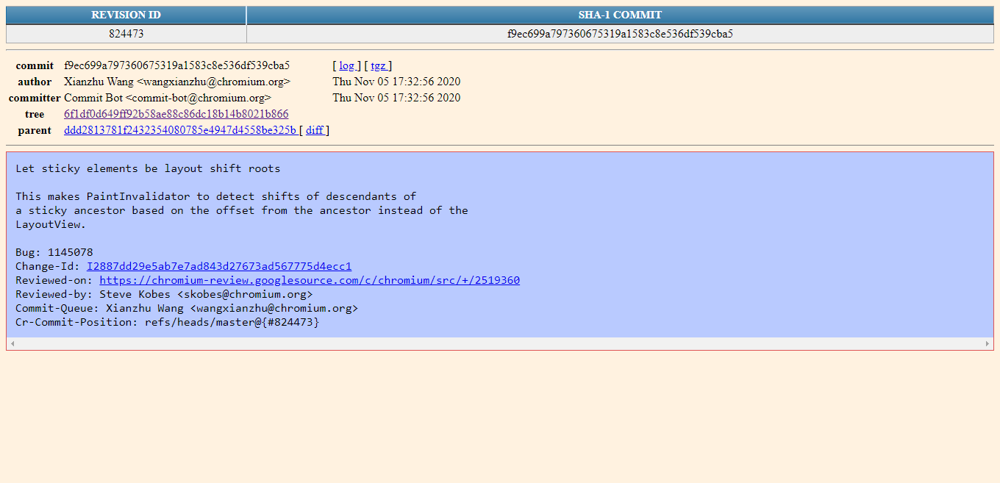

# chromium-web-reference
This repo shows the data scraped from Chromium based webpage on https://chromium.googlesource.com/chromium/src/

## How it works
The [Chromium Browser Snapshots](https://commondatastorage.googleapis.com/chromium-browser-snapshots/index.html) refers to most of Chromium browser's snapshots, which renders a responsive document beside resources related to browser through the platforms from last revision/version. 

<code>chromium-web-reference</code> has an file `main.py`, that contains Python code.

View live version at https://web-sys1.github.io/chromium-web-reference/
